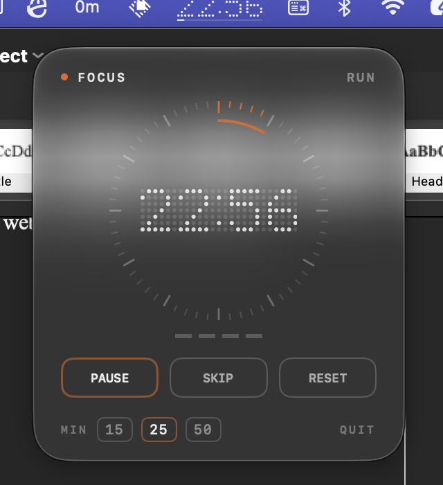

# PomoDot

A Pomodoro timer that lives in the macOS menu bar, drawn as a dot-matrix display on a
sheet of genuinely transparent Liquid Glass.

Nothing's NDot lineage for the numerals — 5×7 rounded dots on a grid, unlit cells and all,
traced back to 1980s IBM mainframe displays. Teenage Engineering's discipline for everything
else — monospaced type exclusively, micro-caps legends, a 60-tick instrument ring, and a
single accent colour that exists only while you're actually focusing.



## Install

Requires macOS 26 or later (Liquid Glass is a macOS 26 API) and a Swift 6.2+ toolchain.

```bash
git clone <this repo> && cd PomoDot
./build.sh release
open build/PomoDot.app
```

To keep it around: `cp -R build/PomoDot.app /Applications/`.

There's no `.xcodeproj` — an `.app` is a directory with an `Info.plist`, and `build.sh`
assembles one from the SwiftPM product in about a dozen lines.

## Using it

Click the countdown in the menu bar to open the panel.

| Control | Does |
|---|---|
| **START / PAUSE** | Runs or holds the current phase |
| **SKIP** | Abandons this phase and moves to the next. A skipped focus earns no session pip |
| **RESET** | Returns the current phase to full length |
| **MIN 15 / 25 / 50** | Sets the focus length |
| **QUIT** | Quits |

Cadence is the standard one: focus → short break, and every 4th *completed* focus earns a
long break. The four dashes under the dial are the session pips; they reset when you take
the long break.

When a phase ends the app plays a sound, pulses the menu bar item, and opens the panel.

## Design notes

Three decisions did most of the work.

**The unlit dots are load-bearing.** Rendering the whole 5×7 grid — dim cells and all — is
what makes it read as a dot-matrix *display* rather than a stylised font. It also does real
work: the dim grid is a local scrim, giving the lit dots a field to sit against, which is
what lets the panel use `Glass.clear` without a background plate behind the numerals. The
aesthetic choice and the legibility requirement turned out to be the same choice.

That argument does *not* survive at menu bar scale, and the build originally got this wrong.
At a 1.7pt dot the unlit cells sit too close to the lit ones to be told apart and the whole
block smears into a grey rectangle — and a template image has nothing to be legible
*against* anyway, because macOS guarantees its contrast. So the menu bar draws lit dots only.

A related trap, also tried and rejected: making the unlit cells a fixed *dark substrate*,
the way a physical matrix display has one. It reads well in theory and badly in practice —
over a mid-tone backdrop the dark cells contrast with the *backdrop*, so lit and unlit dots
compete and the digits collapse into noise. The rule that actually governs is that unlit
cells must sit close to the backdrop so only the lit ones pop, which is what deriving them
from the lit colour at low alpha does in either appearance.

**No text is ever the accent colour.** Over translucency the backdrop can be any colour, so
a fixed orange hue is a coin flip — orange text over a warm wallpaper simply disappears
(measured, over saturated test bands). Every label is `.primary`, which resolves against the
material. The accent lives in the status LED, the swept ticks, the progress arc, the pips
and the button strokes — marks that only have to be *noticed*, not *read*. This is also more
faithful to the references: Teenage Engineering colours the hardware, never the legends.

**Time is read from a clock, never accumulated.** The engine stores an absolute deadline and
subtracts. A timer that decrements a counter stops being ticked while the process is
suspended and comes back having silently lost however long the lid was closed. As a
corollary the tick rate is irrelevant to correctness — the 1 Hz timer exists only to notice
the zero-crossing and prompt a redraw, and a missed tick self-corrects on the next one.

## Layout

```
Sources/PomoDotKit/     pure, testable core — state machine, glyph table, theme, views
  TimerEngine.swift     deadline-based pomodoro state machine
  DotMatrix.swift       5x7 glyph table and layout
  DotMatrixView.swift   SwiftUI dot renderer
  Theme.swift           colour, type and motion tokens
  Dial.swift            tick ring and session pips
  Controls.swift        transport buttons and preset chips
  PanelView.swift       the glass panel
Sources/PomoDot/        AppKit shell
  PomoDotApp.swift      app delegate, status item, panel lifecycle
  GlassPanel.swift      the transparent NSPanel
  StatusItemRenderer.swift  Core Graphics template image for the menu bar
Tests/                  19 tests over the engine and glyph table
ISA.md                  what "done" means for this project, as 41 testable criteria
```

Zero third-party dependencies. `swift test` runs the suite.

## Known limits

- **No notification-centre alerts and no launch-at-login.** Both `UNUserNotificationCenter`
  and `SMAppService` need a signed, notarised bundle; from an ad-hoc build they fail
  silently, which is worse than not offering them. The sound-plus-pulse-plus-open-panel
  alert works on any build. `ponytail:` upgrade path — add both once signed with a
  Developer ID.
- Single display assumed for panel placement; it anchors to the status item's own screen but
  hasn't been exercised across an unplug/replug.
- Break lengths aren't exposed in the UI yet (they persist, and the engine takes them).
